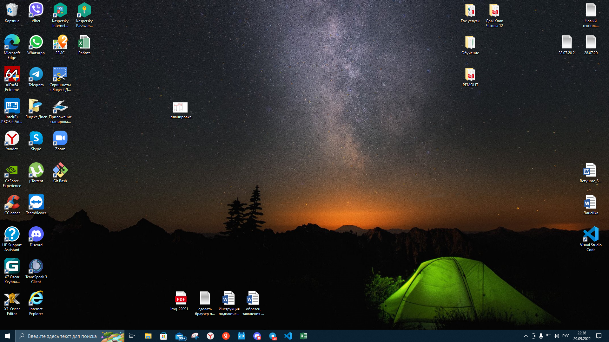

# Анкета

1. Меня зовут Скрынник Александр Александрович
2. Я учусь на разработчика.
3. В данный момент, я работаю Инженером-технологом в поддержке пользователей, по сопровождению програмного обеспечения

>Статус intern

* Недавно в программировании!

Отличный у Вас снимок, вот мой

> Так же можно найти меня в телеграмм https://t.me/SkrynnikAA буду рад знакомству 

* Спасибо за Ваш Репозиторий
* Всего доброго